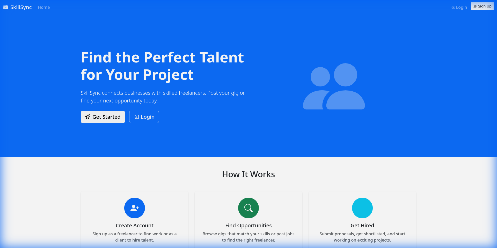
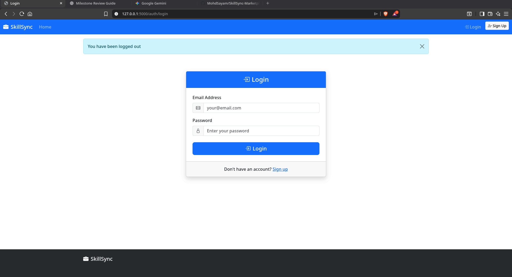

# SkillSync Marketplace

A freelance marketplace web application built with Flask. Connects businesses with skilled freelancers for project-based work.

## Features

**For Freelancers**
- Browse available gigs from clients
- Submit proposals with cover letters
- Track application status (Applied, Shortlisted, Hired, Rejected)

**For Clients**
- Post new gigs with title, description, and budget
- View and manage applications
- Shortlist, hire, or reject freelancers

**For Admins**
- Manage all clients and freelancers
- View and edit all gigs
- Monitor all applications

## Screenshots

### Home Page


### Login Page


## Tech Stack

- **Backend**: Flask 3.0, Flask-SQLAlchemy
- **Database**: SQLite
- **Frontend**: Jinja2, Bootstrap 5
- **Authentication**: Session-based with Werkzeug password hashing

## Project Structure

```
SkillSync-MarketPlace/
├── main.py                 # Application entry point
├── requirements.txt        # Python dependencies
├── controller/
│   ├── config.py           # App configuration
│   ├── database.py         # SQLAlchemy setup
│   ├── models.py           # User, Client, Gig, Application models
│   ├── routes/             # Blueprint routes
│   │   ├── auth_routes.py
│   │   ├── admin_routes.py
│   │   ├── client_routes.py
│   │   └── freelancer_routes.py
│   └── utils/
│       └── decorators.py   # login_required, admin_required, etc.
├── templates/              # Jinja2 templates
├── scripts/
│   └── setup.py            # Database and admin setup
└── screenshots/
```

## Installation

### 1. Clone the repository
```bash
git clone https://github.com/YOUR_USERNAME/SkillSync-MarketPlace.git
cd SkillSync-MarketPlace
```

### 2. Create virtual environment
```bash
python -m venv venv
source venv/bin/activate        # Linux/Mac
venv\Scripts\activate           # Windows
```

### 3. Install dependencies
```bash
pip install -r requirements.txt
```

### 4. Setup database and admin user
```bash
python scripts/setup.py
```

This creates the database tables and an admin user:
- Email: `admin@skillsync.com`
- Password: `admin123`

### 5. Run the application
```bash
python main.py
```

Open http://127.0.0.1:5000 in your browser.

## Quick Start (2 Commands)

```bash
pip install -r requirements.txt
python scripts/setup.py && python main.py
```

## User Roles

| Role | Access |
|------|--------|
| Admin | Full access to all features, manage users |
| Client | Create gigs, manage applications |
| Freelancer | Browse gigs, submit applications |

New users signing up are assigned the Freelancer role by default. Clients are created by Admins.

## Default Credentials

| Role | Email | Password |
|------|-------|----------|
| Admin | admin@skillsync.com | admin123 |

## License

MIT License
